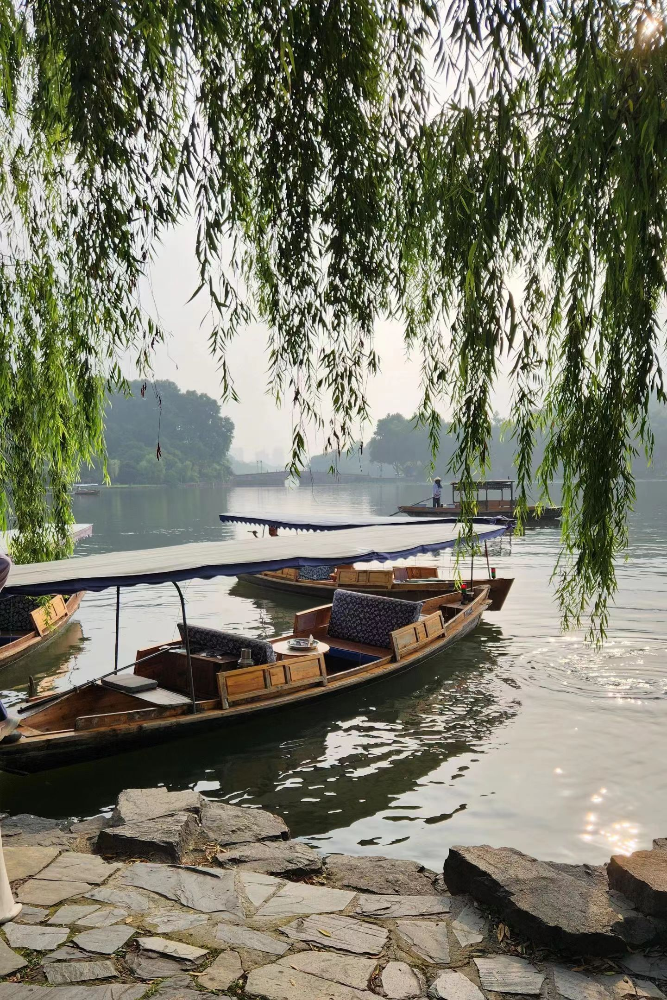
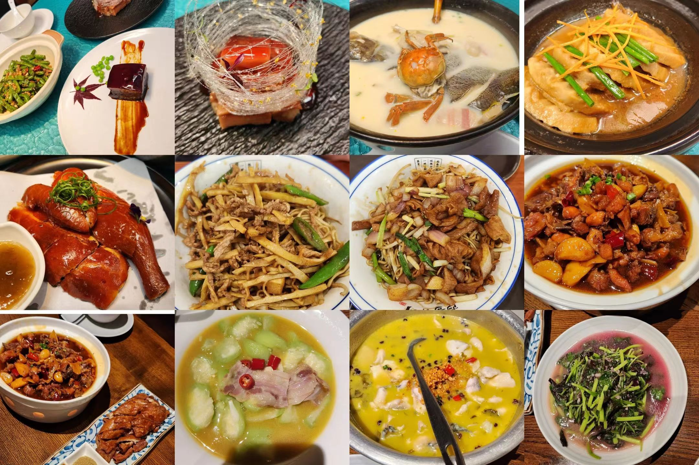

(The following is the English version of Junny's shared content. Please switch to the Korean version page to view the original content.)

[@Junny @小红书](https://www.xiaohongshu.com/user/profile/62e52759000000001e01c35d)

1. **"Where are you from, is this your first time in China?"**

I am from South Korea, and I am currently living and working in the UK. I have been to Taiwan, Hong Kong, and Macau before, but this is my first trip to Mainland China.

2. **"What made you come to China, and what are you most interested in?"**

- I really wanted to visit China because I was always eager to try authentic Chinese cuisine, as my Chinese friends told me that Chinese restaurants abroad are not that authentic.
- I have always been interested in Chinese culture, so I wanted to immerse myself into a diverse local culture in China.
- After arriving in China, what interested me most are trying various cuisines and exploring beautiful landscapes in different parts of China.

3. **"Can you share some cultural or travel experiences in China that impressed you?"**

- An indelible travel experience was taking a boat around West Lake in Hangzhou at 7am, fully experiencing the beautiful scenery of China.
- The hotel I stayed at in Shanghai had a robot that would deliver takeout food to my room's door, which was amazing and very advanced!

4. **"What do you think are the three most challenging things in China?"**

- 1) Visa-free entry to China,
- 2) Riding a bicycle back to the hotel in the early morning,
- 3) Trying food I have never eaten before (rabbit meat)

5. **"Three tips for other foreigners traveling in China?"**

- 1) If you can master some basic Chinese conversation, it would very useful when traveling in China.
- 2) Download apps like WeChat, Alipay, Meituan, Dianping, Amap, Ctrip before traveling to China, which will make the trip more convenient.
- 3) Try not to carry too much cash, as it is more convenient to pay electronically.

6. **"Why should foreigners consider traveling to China?"**

- The diverse cultures and cuisines, the various landscapes, and the very advanced payment technology.

7. **"Three of your favorite photos or short videos taken in China?"**

Scenery of West Lake in Hangzhou

Urban scenery shot at the Bund in Shanghai

Chinese cuisine photo album

8. **"Which 3 Chinese cities or attractions would you recommend to your family and friends?"**

Urumqi in Xinjiang, Chongqing, Yunnan