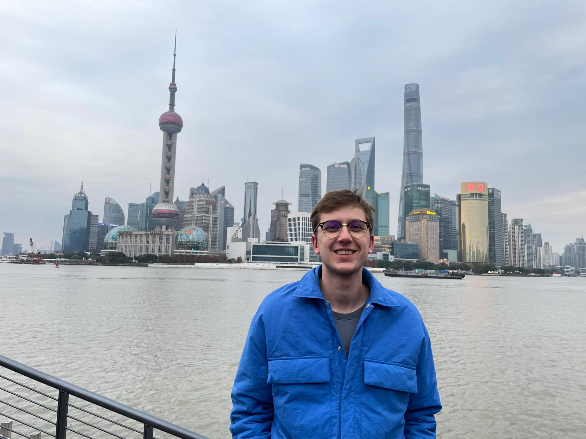
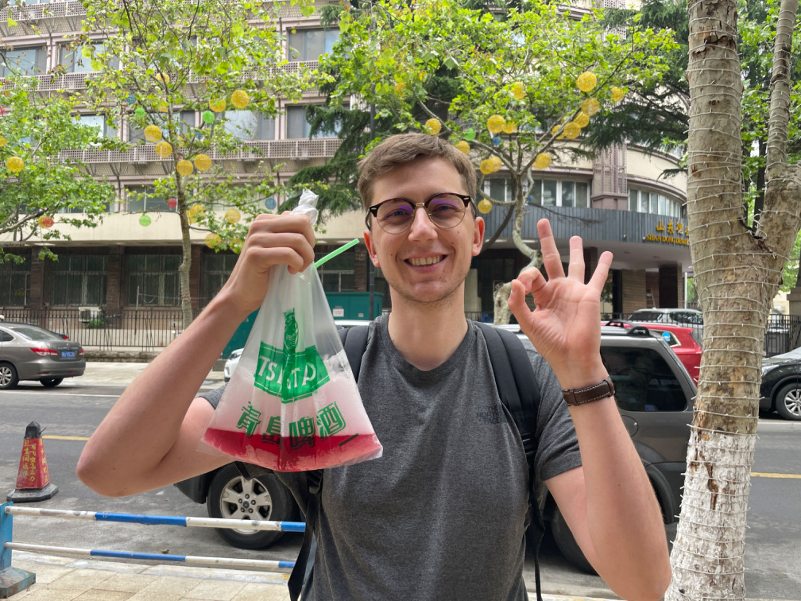

(이 아래는 Thibaut Grzelak이 공유한 내용의 한국어 버전입니다. 원래 내용은 영문 페이지에서 확인하세요.)

[@ThibautGrzelak @젊은소녀수필](https://www.xiaohongshu.com/user/profile/650068660000000004026a3c)   

1. **"너는 어디서 왔니? 이번이 중국에 처음 오는 거야?"**

안녕하세요, 제 이름은 Thibaut이고 27세이며 프랑스에서 왔습니다.

2017년에 베이징을去过并且非常喜欢那里。그때, 나는 기회가 된다면, 나는 一定会回来工作在这里라고 말했습니다. 이제 왔습니다!

2. **"당신이 중국에 오게 된 것은 무엇이며, 중국에서 가장 흥미로워하는 것은 무엇입니까?"**

저는 중국의 문화와 음식, 그리고 중국 사람들의 생활 방식을 좋아합니다.

저는 또한 이 나라가 매우 아름답고 산과 해안과 같은 많은 관광지가 있다고 생각합니다.

3. **"중국에서 깊은 인상을 받은 문화적 또는 여행 경험을 몇 가지 공유할 수 있습니까?"**

제가 중국어를 잘하지 못해서 사람들과 대화할 때 헷갈리거나 곤란을 겪는 것이 자주 있습니다.

예를 들어, 음식을 사려고 할 때 그들이 제가 무엇을 말하려는지 잘 이해하지 못해서 제가 요청하지 않은 것을 주거나, 가끔은 제가 뭘 묻는지 전혀 모르기도 합니다.

어쨌든 사람들은 제게 도움을 주려고 노력하고, 여러 번 질문을 반복하고, 제가 이해할 수 있도록 동작을 보여줍니다! 저는 또한 사람들이 매우 친절하고 정열적이라고 생각하며, 관심을 보이면 그들은 기꺼이 당신을 돕거나 당신과 시간을 공유할 것입니다.

4. **"중국에서 가장 도전적인 세 가지 것은 무엇이라고 생각하십니까?"**

* **행정부서:** (중국에서) 일을 하더라도 모든 서류를 얻고 검사를 통과하는 것은 어렵습니다. 이 나라에 도착하더라도 (작업 카드, 경찰이 귀하의 주소를 보고 등) 많은 절차를 따라야 하며 언어 장벽으로 인해 이것은 어렵습니다.
* **음식:** 여기에서 저는 나榴莲, 臭豆腐 그리고 몇 가지 생선. 어쨌든, 이것은 좋은 놀라움이며 경험의 일부입니다.
* **작업:** 사람들이 여기에서 일하는 방식은 제가 전에 알고 있던 것과 매우 다릅니다. 처음에는 좀 놀랄 수도 있고, 새로운 습관에 적응해야 합니다!

5. **"중국에서 여행하는 다른 외국인에게 세 가지 조언이 있다면?"**

* 출발 전에 중국 앱을 설치하고 (支付宝, 微信, 지도, 번역 소프트웨어) 작동하는지 확인하세요. 그렇지 않으면 곤란하고 도전적이 될 수 있습니다.
* 호텔을 주의 깊게 확인하세요, 대부분의 호텔은 외국인을 받지 않습니다.
* 기본 중문을 배우세요!

6. **"외국인들이 중국에서 여행을 고려해야 할 세 가지 이유는 무엇입니까?"**

* 강한 문화와 친절한 사람들이 있는 아름다운 나라입니다. 이 나라는 차 원과 같은 웅장한 경치를 가지고 있습니다.
* 음식은 진정한 경험이며, 국가가 매우 광대하기 때문에 여러 가지 다른 경험을 할 수 있습니다.
* 이 나라는 잘 알려지지 않았으며, 그들이 발견한 것에 놀랄 수 있습니다!

7. **"중국에서 찍은 세 장의 가장 좋아하는 사진이나 짧은 동영상은 무엇입니까?"**

* Thibaut Grzela 상하이 번드

* Thibaut Grzela 칭다오, 핸드백 맥주

* Thibaut Grzela 지부, 꼬치구이를 먹고

