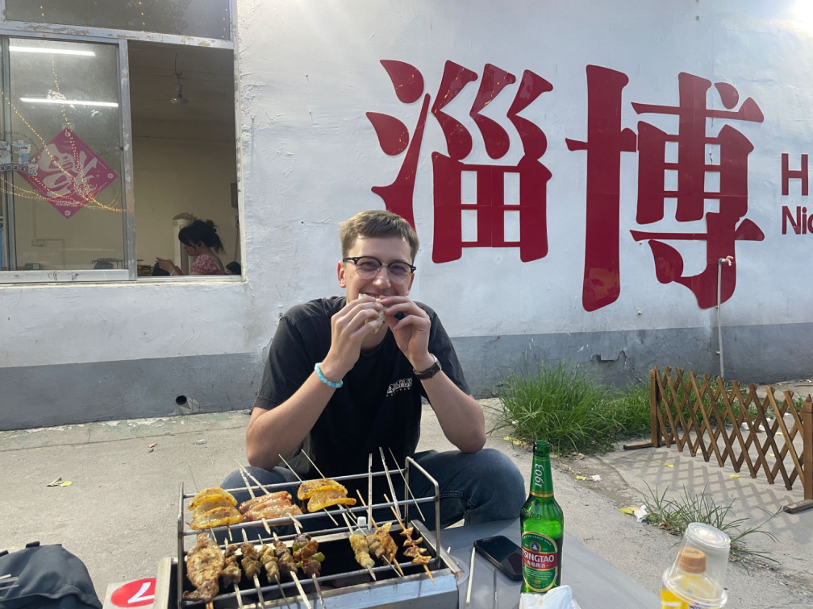

(Далее представлена русская версия общего контента от Thibaut Grzelak. Для просмотра оригинального контента, пожалуйста, перейдите на английскую версию страницы.)

[@ThibautGrzelak @Xiaohongshu](https://www.xiaohongshu.com/user/profile/650068660000000004026a3c)   

1. **"Откуда вы, это ваша первая поездка в Китай?"**

Привет, меня зовут Thibaut, мне 27 лет, и я из Франции.

В 2017 году я был в Пекине и очень там понравилось. Тогда я сказал себе, что если у меня будет возможность, я обязательно вернусь сюда работать, и теперь я здесь!

2. **"Что вас привлекает в Китай, и чем вы наиболее заинтересованы в Китае?"**

Я люблю китайскую культуру, еду и образ жизни китайцев.

Я также считаю, что это очень красивая страна с множеством мест, которые стоит посетить, например, горные цепи и побережье.

3. **"Можете ли вы поделиться некоторыми впечатлениями от культуры или путешествий в Китае, которые вам запомнились?"**

Так как мой китайский язык не очень хорош, я часто испытываю путаницу или сталкиваюсь с проблемами при общении с людьми.

Например, когда я пытаюсь купить еду, они не всегда понимают, о чем я, и дают мне то, чего я не заказывал, или иногда они не имеют понятия, о чем я говорю.

В любом случае, люди всегда стараются мне помочь, повторяя вопросы и показывая мне жестами! Я также считаю, что люди здесь очень дружелюбны и гостеприимны, и если вы проявите интерес, они с радостью помогут вам или поделятся с вами своим временем.

4. **"Какие три вещи вы считаете наиболее вызывающими сложности в Китае?"**

* **Административные процедуры:** Даже работая в Китае, сложно получить все необходимые документы и пройти проверку. Прибыв в страну, вам нужно следовать многим процедурам (работа卡牌, уведомления о проживании в полицейских участках и т.д.), что является сложным из-за языкового барьера.
* **Еда:** Здесь у меня была возможность попробовать много новых для меня продуктов, таких как榴连、臭豆腐и некоторые виды рыбы. В любом случае, это приятный сюрприз и часть опыта.
* **Работа:** Мanner of work of people here is very different from what I knew before. At first, this can be a bit surprising, you need to adapt to new habits!

5. **"Три совета для других иностранцев, путешествующих по Китаю?"**

* Установите китайские приложения, такие как Alipay, WeChat, Maps, Translation Software, перед отъездом и убедитесь, что они работают, иначе это может быть очень сложно и вызовом.
* Тщательно проверьте отель, так как многие отели отказываются отмечать иностранных туристов.
* Изучите основы китайского языка!

6. **"Зачем иностранцам стоит посетить Китай?"**

* Это страна с сильной культурой и дружелюбным населением. В стране великолепные пейзажи от чайных плантаций до горных лань.
* Еда является настоящим опытом, и из-за обширности страны, у вас будет возможность попробовать много разных блюд.
* Страна не так уж и известна, и они могут быть удивлены тем, что会发现！

7. **"Три ваших любимых фотографии или коротких видео, которые вы сделали в Китае?"**

* Thibaut Grzela на набережной Шанхая

* Thibaut Grzela в Циндао, держит упакованное пиво в руке

* Thibaut Grzela в Цзыбо, ест шашлыки

