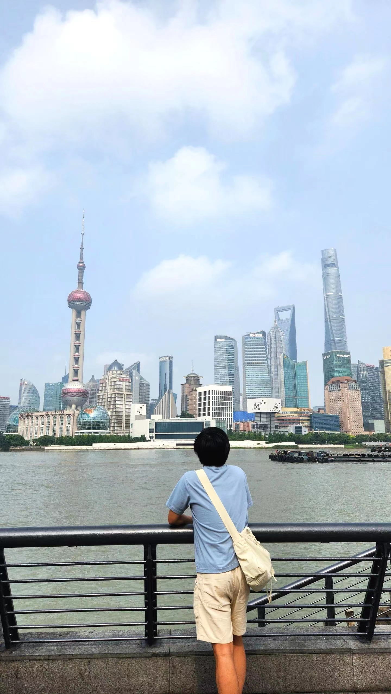

[@Junny @小红书](https://www.xiaohongshu.com/user/profile/62e52759000000001e01c35d)

1. **"你来自哪里，这是你第一次来中国吗？"**

我是一个在英国工作的韩国人。之前去过台湾、香港和澳门，但这是我第一次去中国大陆旅游。

2. **"是什么让你来到中国，你最感兴趣的是什么？"**

- 我想去中国是因为我想尝试一下正宗的中国美食，因为我的中国朋友们说国外的中餐厅不是很正宗。
- 而且我一直对中国文化感兴趣，所以想去中国多探索一点本地的文化。
- 来到中国后，我最感兴趣的是中国各地的各种美食和风景。

3. **"你能分享一些在中国让你印象深刻的文化或旅行经历吗？"**

- 印象深刻的旅行经历是早上7点在杭州西湖坐船环湖一圈，充分感受到了中国的美丽风景。
- 我在上海住的一家酒店有个机器人会把外卖送到我房间的门口，这真是太神奇了！也非常高级！

4. **"在中国你觉得最有挑战的三件事是什么？"**

- 1) 免签入境中国，
- 2) 凌晨骑自行车回酒店，
- 3) 尝试了从未吃过的食物（兔肉）

5. **"给在中国旅行的其他外国人的三个建议？"**

- 1) 如果你能掌握基本的中文会话的话，你在中国旅游时非常有用。
- 2) 在来中国旅游之前，提前下载微信、支付宝、美团、大众点评、高德地图，携程旅行等软件，会让旅行更方便。
- 3) 尽量不要带太多现金，因为用微信支付更方便。

6. **"外国人应该考虑来中国旅游的三个理由是什么？"**

- 各地多样的文化和美食，各地多样的风景，非常发达的尖端支付技术

7. **"三张你在中国拍摄的最喜欢的照片或短视频？"**

杭州西湖风景

上海外滩拍摄的城市风景

中国美食相册

8. **"你会向家人和朋友推荐哪3个中国的城市或景点？"**

新疆乌鲁木齐、成都、云南