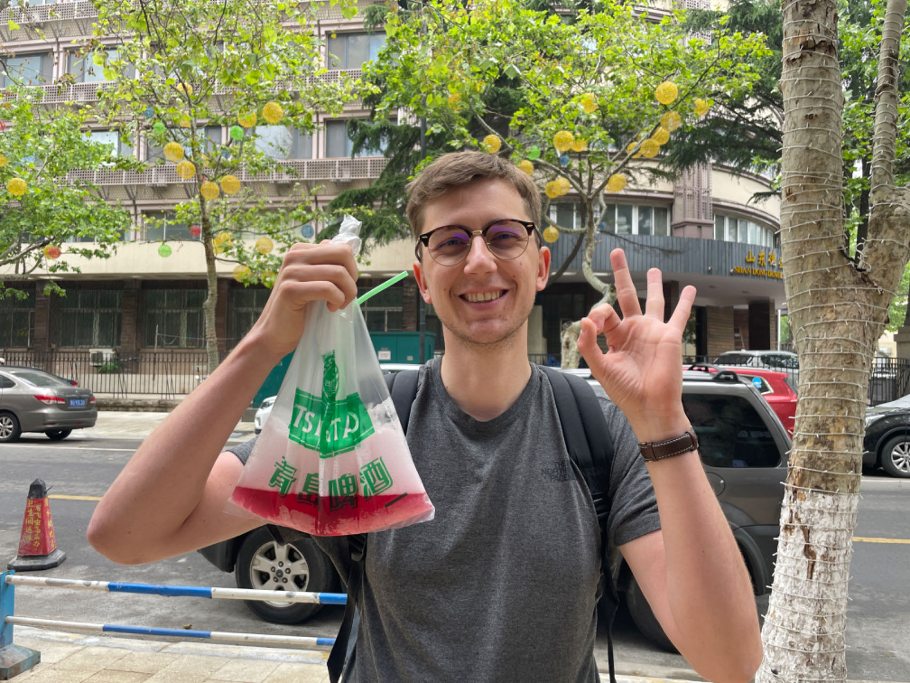
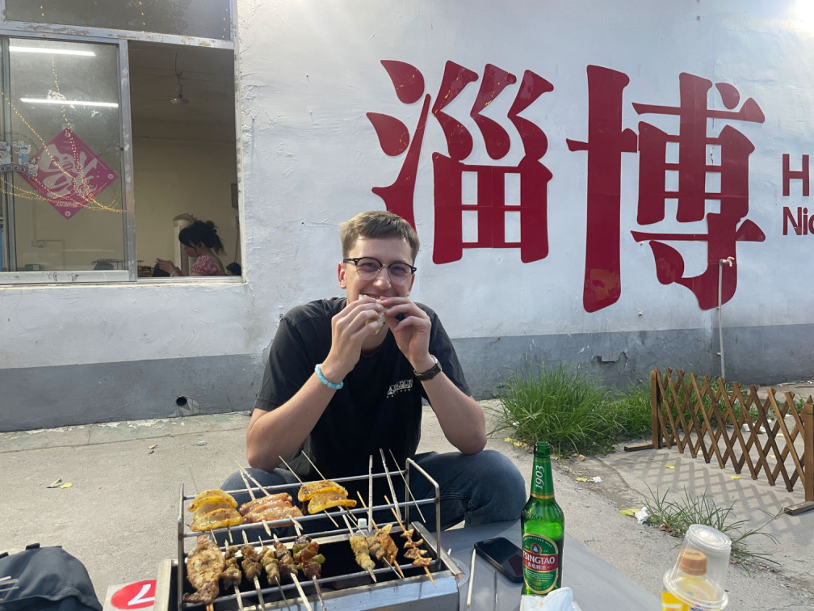

（以下是Thibaut Grzelak 分享内容的中文版翻译，原始内容请切换至英文版页面查看）

[@ThibautGrzelak @小红书](https://www.xiaohongshu.com/user/profile/650068660000000004026a3c)

1. **"你来自哪里，这是你第一次来中国吗？"**

你好，我叫Thibaut，我27岁，来自法国。

2017年，我去过北京，并且非常喜欢那里。那时，我告诉自己如果有机会，我一定会回来工作的，现在我来了！

2. **"是什么吸引你来到中国，对中国你最感兴趣的是什么？"**

我喜欢中国文化、中国食物和中国人的生活方式。

我也认为这个国家非常美丽，有很多值得游览的地方，比如山脉，还有海岸。

3. **"你能分享一些在中国让你印象深刻的文化或旅行经历吗？"**

因为我的普通话不是很好，我经常在与人交流时感到困惑或遇到麻烦。

例如，当我尝试购买一些食物时，他们不太理解我的意思，给了我一些我没有要求的东西，或者有时候他们完全不知道我在问什么。

无论如何，人们会尝试帮助我，多次重复问题，并用手势向我展示！我也认为人们非常友好和热情，如果你表现出兴趣，他们会很乐意帮助你或与你分享时光。

4. **"在中国你觉得最有挑战的三件事是什么？"**

*  **行政部门：** 即使是(在中国)工作，也很难获得所有文件并通过检查。即使到达这个国家，你也需要遵循很多程序（工作卡、警察报告你的地址等），由于语言障碍，这很困难。
*  **食物：** 在这里，我有机会尝试很多我以前不知道的食物，比如榴莲、臭豆腐和一些鱼。无论如何，这是一个不错的惊喜，也是体验的一部分。
*  **工作：** 这里人们的工作方式与我过去所知道的非常不同。起初，这可能会有点令人惊讶，你需要适应新的习惯！

5. **"给在中国旅行的其他外国人的三个建议？"**

* 在出发之前安装中国应用程序，并确保它们可以工作（支付宝、微信、地图、翻译软件），否则可能会很棘手和具有挑战性。
* 仔细检查酒店，因为大多数酒店拒绝接待外国人。
* 学习一些基础的普通话！

6. **"外国人应该考虑来中国旅游的三个理由是什么？"**

*  这是一个有着强烈文化和友好人民的美丽国家。这个国家有着壮丽的景观，从茶园到山脉。
* 食物是一次真正的体验，由于国家非常广阔，你可以有很多不同的体验。
* 这个国家并不广为人知，他们可能会对他们所发现的东西感到惊讶！

7. **"你在中国拍摄的三张最喜欢的照片或短视频？"**

* Thibaut Grzela 在上海外滩

* Thibaut Grzela 在青岛，手中是袋装啤酒

* Thibaut Grzela 在淄博，吃烤串

